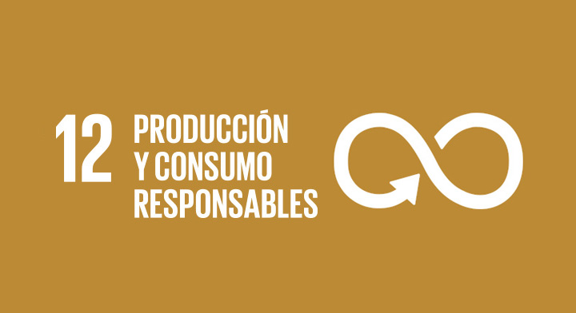

## La segunda vida de los polímeros, ¿La conocias?

### Introducción

Describe de qué trata tu proyecto:
* ¿qué problema vas a abordar?
* ¿porqué es importante?
* ¿cómo se relaciona con la **ODS** asignada a tu club? 
* ¿cómo se relaciona lo aprendido en tu club para resolver el problema que planteaste?

### Métodología

Describe los pasos específicos que tomaste para realizar tu proyecto. Trata de hacer una descripción concreta y detallada. Si aplica, puedes incluir un diagrama describiendo el procedimiento. 

### Resultados

Este es el momento en que nos compartas los resultados obtenidos en tu proyecto. Asegurate de incluir material visual (gráficas, fotos, diagramas, tablas). 

Puedes inster imagenes utilizando Markdown ``.

O utilizando codigo html ``, la ventaja de utilizar html es que le puedes modificar el tamaño utilizando **width**.

### Conclusiones

Comparte tus observaciones, lo aprendedido, limitaciones y siguientes pasos. 

### Video
 1. Para insertar un video de YouTube, en la página de YouTube del video selecciona compartir y selecciona el código de html.
 <iframe width="560" height="315" src="https://www.youtube.com/embed/PLj1-CMNERM" title="YouTube video player" frameborder="0" allow="accelerometer; autoplay; clipboard-write; encrypted-media; gyroscope; picture-in-picture" allowfullscreen></iframe>
 
 2. Insertar el link de tu video en YouTube, [nuestro video](https://youtu.be/rmXvlBPq24Q).
 4. Puedes subir el archivo de tu video directamente a Github [instrucciones aquí](https://stackoverflow.com/questions/4279611/how-to-embed-a-video-into-github-readme-md)
 
### Equipo

* Johanna López Jáurez
* María Alejandra Correa Sauri
* Flor Esmeralda Contreras Escobar

