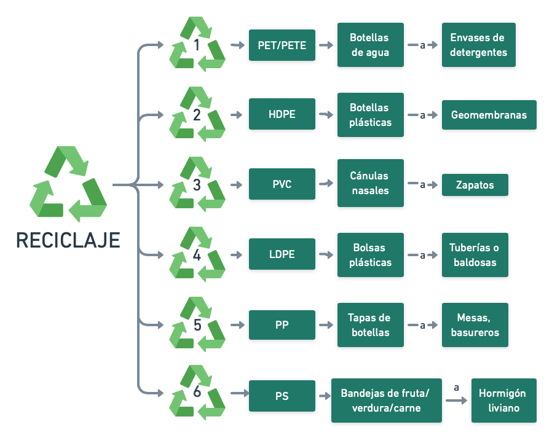

## La segunda vida de los polímeros, ¿La conocias?

### Introducción

## ¿Qué es un polímero? 

Un polímero es una cadena de unidades de repetición o monómeros que se unen y repiten formando una macromolécula (decenas de millones de unidades repetidas) o polímero.

## Clasificación de polímeros de acuerdo a sus propiedades térmicas

Los polímeros se pueden clasificar de acuerdo a sus propiedades térmicas y al enlace de su cadena:

_Termoplásticos_: Son aquellos que a altas temperaturas pueden fundirse, convirtiéndose en maleables, no están unidos por un enlace químico.

_Termoestables:_ Son polímeros unidos mediante enlaces químicos adquiriendo una estructura final altamente reticulada, por lo que no son maleables. 

_Elastómeros:_ Son polímeros que se pueden estirar con facilidad y regresar a su forma inicial, están unidos por un enlace químico, pero es menor a comparación de los termoestables. 

## Temperatura de  transición vítrea:

La temperatura de transición vítrea (Tg), es la temperatura a la que las cadenas en las regiones amorfas del polímero generan suficiente energía térmica para comenzar a deslizarse entre ellas a una velocidad significativa, provocando una condición rígida. Este es un punto importante, en el reciclaje. 

## ¿Qué problema vas a abordar? 

Hoy en día vivimos en una sociedad consumista, en donde el ser  humano busca satisfacer sus necesidades (alimentación, vestimenta) o facilitar sus tareas diarias. Los productos que se compran normalmente vienen envasados, empaquetados o embolsados y simplemente estos se desechan cuando ya no se necesitan causando un daño al medio ambiente, muchas veces porque no sabemos que estos pueden tener una segunda oportunidad. Para poder adquirir conciencia sobre el problema hay que tener una noción clara y concisa sobre lo que es el reciclaje, proceso mediante el cual los desechos se convierten en nuevos productos o en recursos materiales con el que fabricar otros productos. Los residuos se someten a un proceso de transformación eco-ambiental para poder ser aprovechados en algún proceso de fabricación, reduciendo el consumo de materias primas y ayudando a eliminar residuos.
Por lo que nuestro problema a abordar será: Cómo reciclar cada tipo de plástico según su tipo y clasificación.

## ¿Por qué es importante?

Porque al saber cómo reciclar cada tipo de plástico tendremos mucha más facilidad para crear mejores sistemas y técnicas para su reciclaje 

## ¿Cómo se relaciona con la ODS asignada a tu club? 

El objetivo de la ODS nos plantea que para lograr un crecimiento económico y desarrollo sostenible, es urgente reducir la huella ecológica mediante un cambio en los métodos de producción y consumo de bienes y recursos. En el tema asignado en el Club vimos los diferentes tipos de polímeros y sus características según su tipo y basándonos en esto decidimos ver cómo podemos darle una segunda vida a cada plástico según su tipo de polímero siendo sus características diferentes una entre otra.

## ¿Cómo se relaciona lo aprendido en tu club para resolver el problema que planteaste?

En el club vimos lo que era un polímero, así como diversas características de ellos, nuestro problema es el identificar botellas pet, el cual es un material que puede reciclarse o reutilizarse en la elaboración de algún otro material a base de un programa de identificación.  

## Sabías que  

El reciclaje de los polímeros ayuda a que emitan menos emisiones de gases de efecto invernadero (CO2) a la atmósfera, ya que reducen el consumo de combustibles fósiles. Además su producción con el polímero reciclado requiere menor energía que con el polímero virgen.

### Métodología

Describe los pasos específicos que tomaste para realizar tu proyecto. Trata de hacer una descripción concreta y detallada. Si aplica, puedes incluir un diagrama describiendo el procedimiento. 

### Resultados

Este es el momento en que nos compartas los resultados obtenidos en tu proyecto. Asegurate de incluir material visual (gráficas, fotos, diagramas, tablas). 

Puedes inster imagenes utilizando Markdown ``.

O utilizando codigo html ``, la ventaja de utilizar html es que le puedes modificar el tamaño utilizando **width**.

### Conclusiones

Comparte tus observaciones, lo aprendedido, limitaciones y siguientes pasos. 

### Video
 1. Para insertar un video de YouTube, en la página de YouTube del video selecciona compartir y selecciona el código de html.
 <iframe width="560" height="315" src="https://www.youtube.com/embed/PLj1-CMNERM" title="YouTube video player" frameborder="0" allow="accelerometer; autoplay; clipboard-write; encrypted-media; gyroscope; picture-in-picture" allowfullscreen></iframe>
 
 2. Insertar el link de tu video en YouTube, [nuestro video](https://youtu.be/rmXvlBPq24Q).
 4. Puedes subir el archivo de tu video directamente a Github [instrucciones aquí](https://stackoverflow.com/questions/4279611/how-to-embed-a-video-into-github-readme-md)
 
### Equipo

* Johanna López Jáurez
* María Alejandra Correa Sauri
* Flor Esmeralda Contreras Escobar

